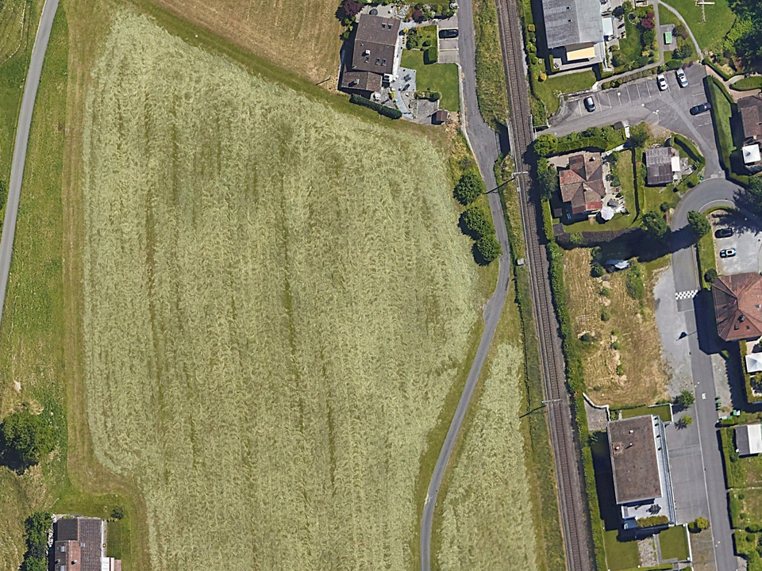
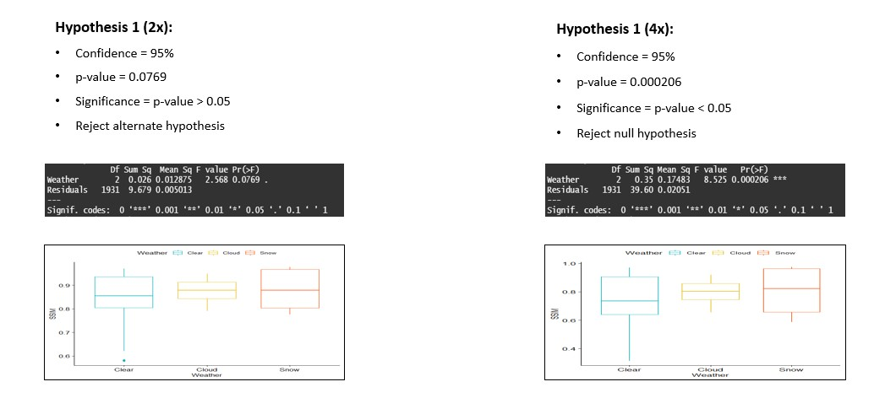
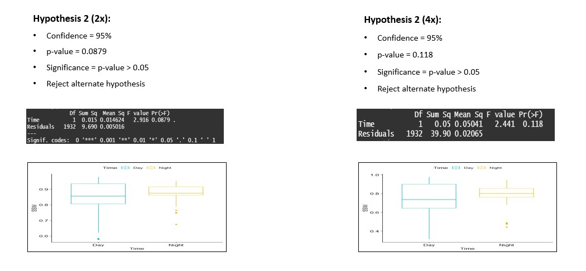

# Image-Super-Resolution
Super resolve using advanced Computer Vision techniques which can generate high quality remote sensing images from sources such as satellites, drones, and aircraft.

## Dataset 
Images considered for training the models are paired images(Aerial and satellite). They are taken across 13 places across Asia and Europe (Suzhou, Kunshan, Weihai, Shennongjia, Wuxi, Birmingham, Coventry, Liverpool, Peak District, Merlischachen, Renens, Lausanne, Le Bourget Airport(Paris)). All images are of dimension 960x720. There are multiple image scenes such as agriculture, airport, beach, buildings, forest, land, parking, playground, road, water. These images are taken in three weather condition clear, cloud, snow during day and night. Data source: https://homepages.inf.ed.ac.uk/rbf/CVonline/Imagedbase.htm#remote

Building             |  Water
:-------------------------:|:-------------------------:
  |  

Snow             |  Playground
:-------------------------:|:-------------------------:
  |  

Night             |  Agriculture
:-------------------------:|:-------------------------:
  |  

## Model
To model design is an Super resolution RESNET network. It consist of multiple convolution blocks, residual blocks and subpixel convolution blocks. Multiple skip connections are used solve the vanishing gradient problem. Activation used is prelu and batch norm is used before multiple layers. Model architecture is as shown below.

Model Architecture
:-------------------------:

The following image shows the input to the super resolution model (2x, 4x) and corresponding output images.

Models input and output 
:-------------------------:

## Results

Error metrics Violin plot of 2x model 
:-------------------------:

Error metrics Violin plot of 4x model 
:-------------------------:

Pixel difference for 2x model predictions 
:-------------------------:

Pixel difference for 4x model predictions
:-------------------------:

## Hypothesis

In order to further evaluate the performance of the model 2 different hypothesis is set to statistically infer results. 

#### Hypothesis 1 
Null hypothesis: Weather group SSIM error means are not different from the overall mean of the data. 
Alternate hypothesis: Weather group SSIM error means are different from the overall mean of the data.

Statistics
:-------------------------:

#### Hypothesis 2 
Null hypothesis: Time of the scenes SSIM error means are not different from the overall mean of the data. 
Alternate hypothesis: Time of the scenes SSIM error means are different from the overall mean of the data.

Statistics
:-------------------------:

References are added to reference.md file.
